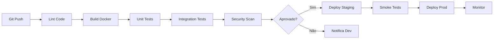

# Introdução a CI/CD - Integração e Entrega Contínua

## O que é CI/CD?

CI/CD é um método para entregar aplicações frequentemente aos clientes através da automação das etapas de desenvolvimento de software.

### CI - Continuous Integration (Integração Contínua)
- **Merge frequente**: Desenvolvedores integram código várias vezes ao dia
- **Testes automatizados**: Cada integração é verificada por build e testes
- **Feedback rápido**: Problemas são detectados rapidamente
- **Código sempre pronto**: Main branch sempre em estado deployável

### CD - Continuous Delivery/Deployment (Entrega/Deploy Contínuo)
- **Continuous Delivery**: Código pronto para deploy (manual)
- **Continuous Deployment**: Deploy automático em produção
- **Releases confiáveis**: Processo repetível e previsível
- **Rollback fácil**: Reverter mudanças problemáticas rapidamente

## Por que CI/CD?

### Problemas sem CI/CD
```
Desenvolvedor A → Trabalha 2 semanas → Merge → 💥 Conflitos
Desenvolvedor B → Trabalha 2 semanas → Merge → 💥 Mais conflitos
                                              ↓
                                    Dias resolvendo problemas
                                              ↓
                                    Deploy manual → 😰 Erros
```

### Com CI/CD
```
Desenvolvedor → Commit → Pipeline → Testes → Deploy → ✅
     ↑                                              ↓
     └──────── Feedback em minutos ←───────────────┘
```

## Pipeline CI/CD

### Estrutura Típica
```yaml
1. Source/Trigger → 2. Build → 3. Test → 4. Deploy → 5. Monitor
      │                │           │          │            │
   Git Push      Compile/Build   Unit     Staging    Production
   PR Open         Docker      Integration  Deploy      Deploy
   Schedule        Package      Security    Smoke      Health
```

### Exemplo Real


## Conceitos Fundamentais

### 1. Pipeline as Code
```yaml
# .github/workflows/pipeline.yml
name: CI/CD Pipeline
on: [push, pull_request]
jobs:
  build:
    runs-on: ubuntu-latest
    steps:
      - uses: actions/checkout@v3
      - run: docker build -t app .
```

### 2. Stages (Estágios)
- **Build Stage**: Compilação, bundling, containerização
- **Test Stage**: Testes unitários, integração, E2E
- **Deploy Stage**: Staging, produção, rollback

### 3. Artifacts
- Binários compilados
- Imagens Docker
- Reports de teste
- Logs de build

### 4. Environments
```yaml
Development → Staging → Production
    ↓           ↓           ↓
  Rápido    Pré-prod    Cuidadoso
  Quebra OK  Testes     Zero downtime
```

## Ferramentas de CI/CD

### Hosted/Cloud
- **GitHub Actions**: Integrado ao GitHub
- **GitLab CI/CD**: Integrado ao GitLab
- **CircleCI**: Focado em velocidade
- **Travis CI**: Popular em open source

### Self-Hosted
- **Jenkins**: Mais antigo e configurável
- **GitLab Runner**: Para GitLab self-hosted
- **Drone**: Leve e container-native
- **ArgoCD**: GitOps para Kubernetes

### Comparação para Nosso Caso
| Ferramenta | Prós | Contras | Quando Usar |
|------------|------|---------|-------------|
| GitHub Actions | Grátis, integrado, fácil | Vendor lock-in | ✅ Nossa escolha |
| Jenkins | Flexível, plugins | Complexo, manutenção | Grandes empresas |
| GitLab CI | Completo, DevOps | Precisa GitLab | Se usa GitLab |

## Práticas Essenciais

### 1. Commits Pequenos e Frequentes
```bash
# Ruim - commit gigante
git commit -m "Adiciona login, registro, recuperação de senha, dashboard"

# Bom - commits atômicos
git commit -m "feat: adiciona formulário de login"
git commit -m "feat: adiciona validação de email"
git commit -m "test: adiciona testes para login"
```

### 2. Branch Strategy
```
main (produção)
  ├── develop (staging)
  │     ├── feature/login
  │     ├── feature/dashboard
  │     └── bugfix/email-validation
  └── hotfix/critical-bug
```

### 3. Testes em Múltiplos Níveis
```
Pirâmide de Testes
        /\
       /E2E\      ← Poucos, lentos, caros
      /──────\
     /Integração\ ← Médio
    /────────────\
   /Unit Tests    \ ← Muitos, rápidos, baratos
  /────────────────\
```

### 4. Feature Flags
```javascript
if (featureFlag('new-dashboard')) {
    return <NewDashboard />
} else {
    return <OldDashboard />
}
```

### 5. Database Migrations
```bash
# Versionamento de schema
migrations/
  ├── 001_create_users_table.sql
  ├── 002_add_email_column.sql
  └── 003_create_index.sql
```

## Métricas de CI/CD

### Lead Time
Tempo do commit até produção
```
Commit → ... → Deploy em Produção
└────────────────────────────────┘
            Lead Time
```

### Deployment Frequency
Quantos deploys por dia/semana
```
Meta: Multiple deploys por dia
Real: Começar com 1 por semana
```

### MTTR (Mean Time to Recovery)
Tempo médio para recuperar de falhas
```
Falha detectada → Fix → Deploy → Recuperado
└──────────────────────────────────────────┘
                    MTTR
```

### Change Failure Rate
Porcentagem de mudanças que causam falhas
```
Deploys com falha / Total de deploys × 100
Meta: < 15%
```

## Anti-patterns a Evitar

### 1. "Works on My Machine"
```yaml
# Ruim
script:
  - npm install  # Versão local diferente

# Bom
script:
  - docker run node:16 npm ci  # Ambiente consistente
```

### 2. Testes Flaky (Intermitentes)
```javascript
// Ruim - depende de timing
await sleep(1000);
expect(element).toBeVisible();

// Bom - espera explícita
await waitFor(() => expect(element).toBeVisible());
```

### 3. Pipeline Monolítico
```yaml
# Ruim - um job gigante
job:
  - lint
  - build
  - test
  - deploy

# Bom - jobs paralelos
lint: ...
build: ...
test: needs: [build]
deploy: needs: [test]
```

### 4. Ignorar Falhas
```yaml
# Ruim
continue-on-error: true  # "Ah, esse teste sempre falha"

# Bom
# Consertar o teste ou removê-lo
```

## Segurança em CI/CD

### Secrets Management
```yaml
# NUNCA hardcode
password: "123456"  # ❌

# Use secrets
password: ${{ secrets.DB_PASSWORD }}  # ✅
```

### Supply Chain Security
```yaml
# Pin versions
uses: actions/checkout@v3  # ✅
uses: actions/checkout@main  # ❌ Pode mudar
```

### SAST/DAST
- **SAST**: Static Application Security Testing (código)
- **DAST**: Dynamic Application Security Testing (runtime)

## Exercício Mental

Reflita sobre seu processo atual:

1. Quanto tempo leva do código até produção?
2. Quantos passos manuais existem?
3. Com que frequência deploys falham?
4. Quanto tempo para reverter uma mudança ruim?
5. Quão confiante você está em fazer deploy na sexta?

## Próximos Passos

1. **GitHub Actions Basics**: Criar primeiro workflow
2. **Multi-stage Pipeline**: Build → Test → Deploy
3. **Docker Integration**: Build e push de imagens
4. **Automated Testing**: Unit, integration, E2E
5. **Deployment Strategies**: Blue-green, canary, rolling

## Leitura Recomendada

- 📚 "Continuous Delivery" - Jez Humble
- 📚 "The DevOps Handbook" - Gene Kim
- 📚 "Accelerate" - Nicole Forsgren

---

💡 **Lembre-se**: CI/CD não é sobre ferramentas, é sobre cultura de entrega contínua de valor!